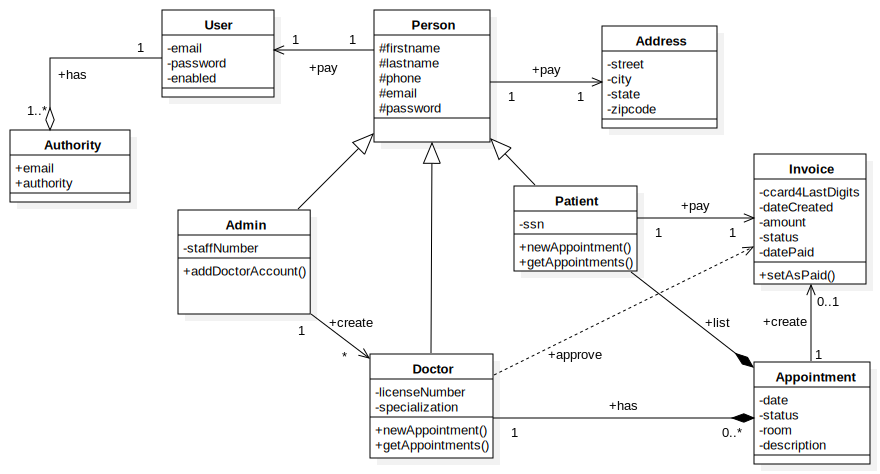
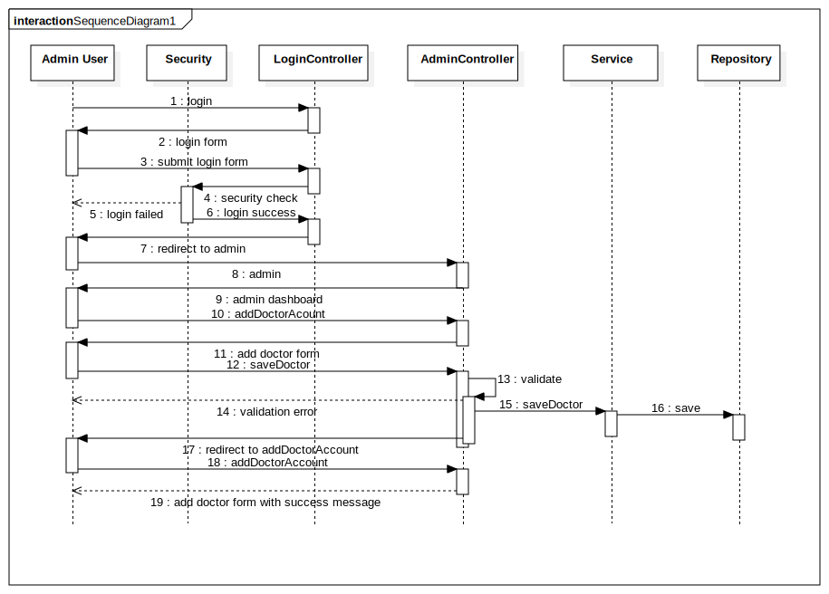

Family doctor
==============

Family doctor is a site for a hospital. It helps the patients manage their appointments. It has dashboard so that patient can create their appointments online and get notified about that. It also helps the doctors to manage their appointments too.

Revision history
=================

Date | Issue | Description | Author
-----|:------|:------------|:-------
8/10/2015|init|This document is created|Long Ma
8/11/2015|Use case diagrams|I added the use case diagrams|Kamanashis Roy
8/12/2015|Sequence diagram|I added doctor creation sequence diagram|Mark Pit
8/12/2015|Class diagram|Updated the class diagram and added it|Toan Quach

Table of contents
==================

- [Introduction](#introduction)
- [Usage scenarios](#usage-scenarios)
	- [Patient registration](#patient-registration)
	- [Registration of doctor by admin](#registration-of-doctor-by_admin)
	- [Registration of doctor by admin](#registration-of-doctor-by_admin)
	- [Patient appointment](#patient-appointment)
	- [Doctor updates appointment](#doctor-updates-appointment)
- [High level design](#high-level-design)
- [Detail design](#detail-design)
	- [Domain](#domain)
	- [Interaction](#interaction)
- [Design alternatives](#design-alternatives)
- [Issues](#issues)
- [Future considerations](#future-considerations)

Introduction
=============
This website helps the patient to communicate with the hospital to create an appointment. Doctors can accept the appointment. And patients can view the prescriptions and history.

Purpose
========

The purpose of the project is to understand the web application architecture. Here we used spring framework, as we learnt it in the theoratical study. As it is only demonstration, it is not fully featured website for patient. 

Usage scenarios
===============

The site has three kinds of users. 

- Patient
- Doctor
- Administrator

The administrator creates doctor. The patient registers in the site and creates appointment. And doctors agrees upon the appointment. Afterwards the patient can see appointment history and prescriptions.

character | description | task 
----------|:------------|:---------------------
Patient | The patient is the client of the hospital. He needs therapy for his or her illness. And he wants to see a doctor. He needs an appointment to do that. | He registers in the hospital and creates appointments.
Doctor | Doctor gives the patient the therapy for illness. He has specialization for some illness. | Doctor confirms registration and he updates the appointments.
Administrator | He is the hospital administrator | He creates new doctor accounts and updates the site.

#### Patient registraion

The patient/user clicks on the Register link on the home page and is directed to the Patient Registration page where they need to fill the patient information. They need to input their firstname, lastname, street address, city, state, zipcode, phone number, date of birth, Social Security Number, email address and password.
After successful registration, they are directed to the Patient dashboard.

#### Registration of doctor by admin

The master admin user will login and clicks on the Add Doctor link which will load the Doctor Registration page.  The Admin fills in the Doctor firstname, lastname, street address, phone, email address, license number, specialization, Social Security Number and a temporary password.  
The doctor is notified via email with his username and password. The doctor will login, enters his username and password in the login page.  After successful login, the doctor is directed to the doctor dashboard.  The doctor then clicks on Account link and is directed to the Account page where the doctor can change his email address and/or password.  

#### Patient appointment

A patient can request an appointment with a specific doctor.  The patient needs to login and proceeds to the patient dashboard where there is a link to create an appointment.  
In the appointment page, the patient needs to fill the form and enter the illness, date the illness started, date and time of appointment request.  The system will check for available date and time of the doctor selected.  The doctors are available from 9AM – 12PM and 2PM – 5PM Monday to Saturday.  If no doctor is selected, the system will assign a doctor who is available on the given date. The appointment for also needs to get the Credit Card information from the user.  This is to ensure the user is serious about the appointment.  

#### Doctor updates appointment

The doctor will login and proceeds to the dashboard where a list of appointments (sorted by date, most recent first) with the status (Pending, Completed).  The doctor clicks on an appointment link and will then shown the appointment page.  In the appointment page the doctor can enter comments or prescriptions and change the status to Completed. When an appointment status is changed to Completed, an automatic payment is created by the system using the patient credit card details.  A payment notification is then sent to the patient email address.

High level design
=================

The project contains a domain model. It has presentation tier, business tier and persistant tier. In the diagram below the components for each tier is demonstrated.

The domain are saved by JPA and they are handled as entity. The service components wraps the business logic. And the controller is used to maintain the interface workflow. 

The domain contains the following entities.

class | description
------|:-----------
Authority | This class along with User helps user login and role based security control.
Admin | It contains the site administrator information.
User | It contains the login information.
Patient | It keeps the patient information.
Doctor | It keeps the doctor information.
Appointment | It contains appointment room,time,date and status.
Invoice | It contains invoice date,amount and status.
Address | It contains address.

Detail design
==============

#### Domain
The class diagram below shows the domain model.

class | description
------|:-----------
Authority | *Authority* is contained by User. The spring security module uses authority role for managing access to the pages and services.
Admin | It is subclass of *Person*. It is the specialization to contain admisnitration related staff. As it has *is a* relationship with *Person*, the super class contains all the address and identification fields. It creates *Doctor* instance.
User | It contains the login information. It contains the *Authority*.
Patient | It keeps the patient information. Again it has *is a* relationship with *Person*. It contains all the appointments. It creates appointments. It can also pay for appointments.
Doctor | It keeps the doctor information. And it has *is a* relationship with *Person*. It contains related appointments. It approves the invoice.
Appointment | It contains appointment room,time,date and status. It is contained by both *Patient* and *Doctor*. It creates the invoice.
Invoice | It contains invoice date,amount and status. It can be payed by the *Patient*.
Address | It contains streat,city and zipcode. It can be contained by *Person*.
Person | It is the generalization of *Doctor*,*Patient* and *Admin*. It contains identification and communication information. It contains *Address*.

#### Interaction

The scenario below shows the admin user logs into the interface. He uses admin controller to submit doctor form. The doctor data is validated and it is udpated by service layer and it is saved by repository layer. Then the page is redirected to a success message page.

Again the diagram below shows the appointment creation. The patient goes to appointment creation page. And the page shows the form. After he submits the form the *AppointmentController* uses *AppointmentService* to create it. The *AppointmentService* uses *DoctorRepository* and *PatientRepository* to retrieve data. And finally it saves data using *AppointmentRepository*.

Design alternatives
===================

We could refactor the code for some changes. And also these features are not everything the Patient wants. So there are possibility of the following changes,

- We could add *Person* as composition over inheritance to maintain a non-hierarchical database. But our inheritance is good because of the is-a relationship to the *Doctor* and *Patient*.
- We could do the validations based on pattern in the domain model rather than the extra validation classes. 

Issues
======

- The doctor delete is not working right now.
- We need to add prescription to the finished appointment.
- There is no spring-application based testing implementations.

Future considerations
======================

The service should be tested by users and there should be site feedback for that.

